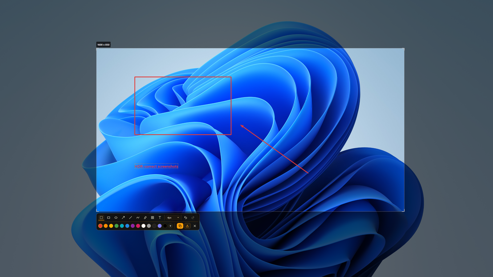

# RoeSnip

[](LICENSE)
[](#quick-start)
[](https://dotnet.microsoft.com/)
[](https://claude.com/claude-code)

An HDR-correct screenshot tool: press PrintScreen, the screen dims instantly,
drag a region, annotate, copy or save. On HDR desktops Windows composites in
linear scRGB FP16, and legacy tools (Snipping Tool, Lightshot, ShareX's
default path) clip or mis-scale that buffer, which is why their screenshots
come out washed-out and gray. RoeSnip captures the true FP16 frame and
converts it properly.



- **HDR done right.** SDR content (the common case) comes out
  pixel-identical to a plain SDR monitor's screenshot: an exact pass-through,
  matched to the "SDR content brightness" level. Genuine HDR highlights get a
  smooth, hue-preserving rolloff instead of blowing out. Optionally saves the
  untouched HDR original as a `.jxr` alongside the PNG, the way Xbox Game Bar
  does.
- **Instant response.** A resident tray process with pre-provisioned capture
  sessions and overlay windows: the dim lands in single-digit milliseconds
  and the interactive overlay opens in under 100 ms, warm or cold.
- **Annotations.** Rectangle, ellipse, arrow, line, freehand, highlighter,
  pixelate (censor mosaic), and text in any installed font. Every placed
  shape stays editable: click it under any tool to move it, drag its handles
  or endpoints, scroll to adjust its stroke/mosaic/font size, with full
  undo/redo.
- **Color picker.** A plain click inspects the pixel under the cursor into a
  compact picker window (hex / RGB / HSL / nits, HDR-aware).
- **Screen recording.** Record the selected region to MP4 or GIF straight
  from the overlay toolbar. A small floating control bar shows elapsed time
  and lets you stop and save or cancel. Pressing PrintScreen again while
  recording stops and saves it, the same shortcut you used to start it.
- **Multi-monitor.** One overlay per monitor, per-monitor HDR state and SDR
  white levels, capture via Desktop Duplication with a
  Windows.Graphics.Capture fallback per monitor.
- **CLI modes.** Headless `--capture` and per-monitor `--diag` HDR
  diagnostics, no UI involved.

## Quick start

Requires Windows 10 2004+ and the .NET 8 SDK to build (the published exe is
self-contained).

```sh
dotnet build RoeSnip.sln -c Release
dotnet test RoeSnip.sln

# single-file exe -> src/RoeSnip/bin/Release/.../win-x64/publish/RoeSnip.exe
dotnet publish src/RoeSnip/RoeSnip.csproj -c Release -p:PublishProfile=win-x64
```

Run `RoeSnip.exe` with no arguments to start the tray app; PrintScreen opens
the capture overlay. If Windows currently intercepts PrintScreen for Snipping
Tool, RoeSnip asks once whether to disable that or use Ctrl+PrintScreen
instead. The hotkey can be changed later from the tray icon's Settings
window. Launching the exe again triggers a capture on the running instance.

Settings live at `%APPDATA%\RoeSnip\settings.json` (hotkey, save directory,
auto-HDR-copy, tone-map overrides, run-at-startup, copy-on-select). A missing
or corrupt file falls back to defaults in memory without being overwritten,
so it can always be inspected or repaired by hand.

## CLI

```sh
RoeSnip.exe --diag
RoeSnip.exe --capture [--monitor N] [--out shot.png] [--jxr]
```

- `--diag` prints per-monitor diagnostics (device, resolution, Advanced Color
  on/off, SDR white level, max luminance) and exits.
- `--capture` captures one or all monitors headlessly, writes PNGs, prints
  min/max/avg captured nits, and with `--jxr` also writes the untouched HDR
  original next to each PNG.

## Docs

- [DESIGN.md](DESIGN.md): behavioral spec covering capture paths, tone
  mapping, overlay semantics, and failure modes.
- [PLAN.md](PLAN.md): the implementation plan the WPF app was built against.
- [DESIGN-XPLAT.md](DESIGN-XPLAT.md) / [PLAN-XPLAT.md](PLAN-XPLAT.md): the
  in-progress cross-platform port (`src/RoeSnip.App`, Avalonia +
  `RoeSnip.Core` + `RoeSnip.Platform.*`) targeting Linux (X11) and macOS
  (`helpers/scksnap`). The WPF app in `src/RoeSnip` is the Windows daily
  driver.
- [TESTING.md](TESTING.md): what has actually been verified, per OS and how.
